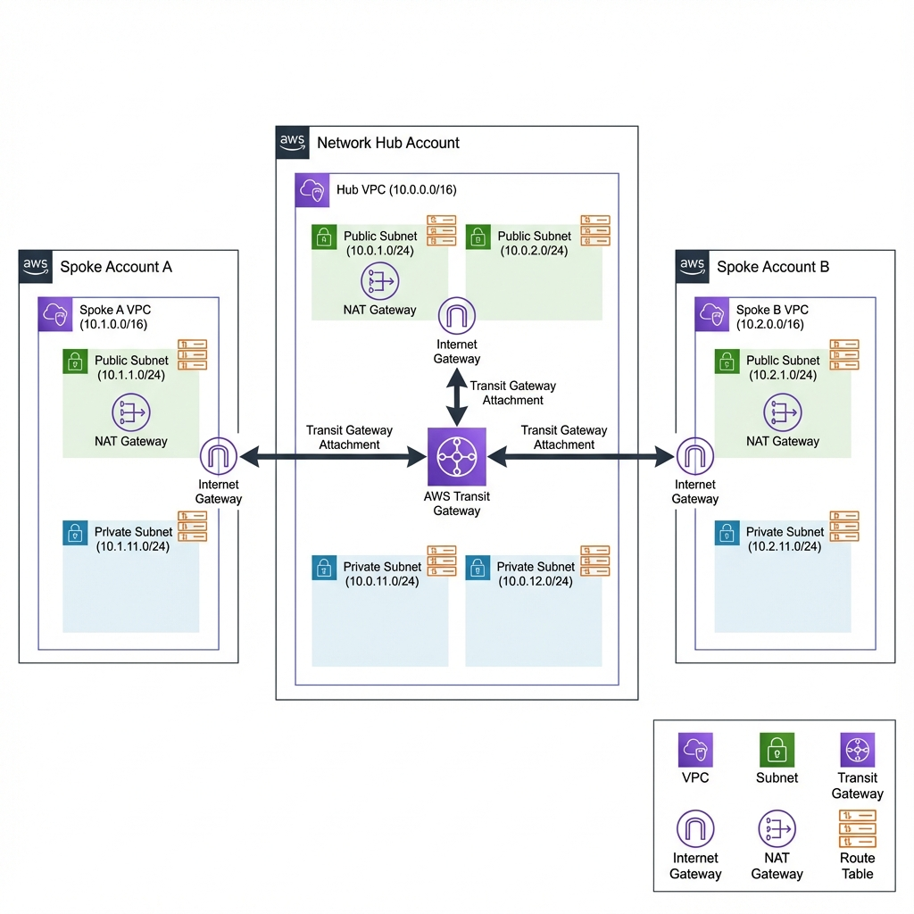

# Centralized VPC & Networking Automation - POC

A production-ready implementation of centralized networking architecture across a multi-account AWS environment using Transit Gateway, CloudFormation StackSets, and GitHub Actions automation.

## 🏗️ Architecture Overview

This POC demonstrates a hub-and-spoke network topology with:
- **Network Hub Account**: Hosts Transit Gateway and central routing
- **Spoke Account A**: Independent VPC integrated with hub
- **Spoke Account B**: Independent VPC integrated with hub



### Network Design

| Account | VPC CIDR | Public Subnets | Private Subnets |
|---------|----------|----------------|-----------------|
| Hub | 10.0.0.0/16 | 10.0.1.0/24, 10.0.2.0/24 | 10.0.11.0/24, 10.0.12.0/24 |
| Spoke A | 10.1.0.0/16 | 10.1.1.0/24 | 10.1.11.0/24 |
| Spoke B | 10.2.0.0/16 | 10.2.1.0/24 | 10.2.11.0/24 |

## 📁 Project Structure

```
Centralized-Networking/
├── .github/
│   └── workflows/
│       ├── validate-templates.yml    # Template validation workflow
│       └── deploy-infrastructure.yml # Deployment automation
├── cloudformation/
│   ├── hub/
│   │   ├── 01-vpc.yaml              # Hub VPC with subnets
│   │   ├── 02-transit-gateway.yaml  # Transit Gateway & routing
│   │   └── 03-iam-roles.yaml        # IAM roles for StackSets
│   ├── spoke/
│   │   ├── vpc.yaml                 # Parameterized spoke VPC
│   │   └── stackset-execution-role.yaml
│   └── test/
│       └── ec2-test-instance.yaml   # Test instances
├── architecture/
│   └── network-diagram.png
├── docs/
│   └── architecture-overview.md     # Detailed documentation
└── README.md
```

## 🚀 Quick Start

### Prerequisites

1. **AWS Accounts**: Three AWS accounts (Hub, Spoke A, Spoke B)
2. **GitHub Repository**: Set up with required secrets
3. **IAM Roles**: StackSet execution roles in spoke accounts

### Required GitHub Secrets

Configure these in your GitHub repository settings:

```
AWS_ROLE_ARN           # ARN of GitHub Actions role in Hub Account
HUB_ACCOUNT_ID         # 12-digit Hub Account ID
SPOKE_A_ACCOUNT_ID     # 12-digit Spoke A Account ID
SPOKE_B_ACCOUNT_ID     # 12-digit Spoke B Account ID
```

### Required GitHub Variables

```
AWS_REGION             # AWS region (e.g., us-east-1)
```

## 📋 Deployment Steps

### Step 1: Prepare Spoke Accounts

Deploy the StackSet execution role in **each spoke account**:

```bash
# In Spoke Account A
aws cloudformation deploy \
  --template-file cloudformation/spoke/stackset-execution-role.yaml \
  --stack-name stackset-execution-role \
  --parameter-overrides HubAccountId=<HUB_ACCOUNT_ID> \
  --capabilities CAPABILITY_NAMED_IAM \
  --region us-east-1

# In Spoke Account B
aws cloudformation deploy \
  --template-file cloudformation/spoke/stackset-execution-role.yaml \
  --stack-name stackset-execution-role \
  --parameter-overrides HubAccountId=<HUB_ACCOUNT_ID> \
  --capabilities CAPABILITY_NAMED_IAM \
  --region us-east-1
```

### Step 2: Deploy via GitHub Actions

Push to the `main` branch to trigger automatic deployment:

```bash
git add .
git commit -m "Deploy centralized networking infrastructure"
git push origin main
```

The GitHub Actions workflow will:
1. ✅ Validate all CloudFormation templates
2. 🏗️ Deploy Hub VPC
3. 🔗 Deploy Transit Gateway
4. 👥 Deploy IAM roles
5. 📦 Create StackSets for spoke VPCs
6. 🌐 Deploy spoke infrastructure

### Step 3: Manual Deployment (Alternative)

If you prefer manual deployment:

```bash
# Deploy Hub Account Infrastructure
aws cloudformation deploy \
  --template-file cloudformation/hub/03-iam-roles.yaml \
  --stack-name hub-iam-roles \
  --capabilities CAPABILITY_NAMED_IAM

aws cloudformation deploy \
  --template-file cloudformation/hub/01-vpc.yaml \
  --stack-name hub-vpc

aws cloudformation deploy \
  --template-file cloudformation/hub/02-transit-gateway.yaml \
  --stack-name hub-transit-gateway
```

## 🧪 Testing Connectivity

### Deploy Test Instances

```bash
# Get VPC and Subnet IDs from CloudFormation outputs
HUB_VPC_ID=$(aws cloudformation describe-stacks --stack-name hub-vpc \
  --query 'Stacks[0].Outputs[?OutputKey==`VPC`].OutputValue' --output text)

HUB_SUBNET_ID=$(aws cloudformation describe-stacks --stack-name hub-vpc \
  --query 'Stacks[0].Outputs[?OutputKey==`PrivateSubnet1`].OutputValue' --output text)

# Deploy test instance in Hub
aws cloudformation deploy \
  --template-file cloudformation/test/ec2-test-instance.yaml \
  --stack-name hub-test-instance \
  --parameter-overrides \
    EnvironmentName=Hub \
    VpcId=$HUB_VPC_ID \
    SubnetId=$HUB_SUBNET_ID \
  --capabilities CAPABILITY_NAMED_IAM
```

### Verify Connectivity

1. Connect to instances using AWS Systems Manager Session Manager
2. Run the connectivity test script:

```bash
# On any test instance
/home/ec2-user/test-connectivity.sh
```

Expected output:
```
Testing Hub VPC (10.0.0.0/16)...
✓ Hub reachable

Testing Spoke A VPC (10.1.0.0/16)...
✓ Spoke A reachable

Testing Spoke B VPC (10.2.0.0/16)...
✓ Spoke B reachable
```

## 🔧 Key Features

- ✅ **Modular CloudFormation**: Reusable, parameterized templates
- ✅ **Cross-Account Deployment**: Automated via StackSets
- ✅ **CI/CD Pipeline**: GitHub Actions for validation and deployment
- ✅ **Transit Gateway**: Centralized routing for all VPCs
- ✅ **High Availability**: Multi-AZ design with NAT Gateways
- ✅ **Security**: Proper IAM roles and security groups
- ✅ **Testing**: Automated connectivity verification

## 📊 Routing Flow

```
Spoke A (10.1.0.0/16) ←→ Transit Gateway ←→ Hub (10.0.0.0/16)
                              ↕
                      Spoke B (10.2.0.0/16)
```

All inter-VPC traffic routes through the Transit Gateway with automatic route propagation.

## 📖 Documentation

- [Architecture Overview](docs/architecture-overview.md) - Detailed architecture documentation
- [Implementation Plan](docs/implementation-plan.md) - Design decisions and rationale

## 🛠️ Customization

### Changing CIDR Blocks

Edit the parameters in `.github/workflows/deploy-infrastructure.yml`:

```yaml
VpcCIDR=10.0.0.0/16          # Hub VPC
PublicSubnet1CIDR=10.0.1.0/24
PrivateSubnet1CIDR=10.0.11.0/24
```

### Adding More Spokes

1. Create a new StackSet in the deployment workflow
2. Use the same `cloudformation/spoke/vpc.yaml` template
3. Provide unique CIDR blocks and environment name

## ⚠️ Important Notes

- Ensure non-overlapping CIDR blocks across all VPCs
- StackSet execution roles must be deployed before StackSets
- Transit Gateway attachments may take 5-10 minutes to become available
- NAT Gateways incur hourly charges

## 🔐 Security Considerations

- All private subnets route internet traffic through NAT Gateways
- Security groups restrict traffic to internal VPC CIDRs
- IAM roles follow principle of least privilege
- GitHub Actions uses OIDC for secure authentication

## 💰 Cost Optimization

To minimize costs:
- Use single NAT Gateway per VPC (not per AZ)
- Delete test instances when not in use
- Consider VPC endpoints for AWS services
- Use Transit Gateway attachments only when needed

## 🐛 Troubleshooting

### StackSet Deployment Fails

- Verify StackSet execution role exists in spoke accounts
- Check trust relationship allows Hub Account to assume role
- Ensure account IDs are correct in GitHub secrets

### Transit Gateway Attachment Stuck

- Wait 10 minutes for attachment to complete
- Check subnet route tables have routes to TGW
- Verify TGW route table has proper associations

### Connectivity Test Fails

- Verify security groups allow ICMP
- Check route tables have TGW routes
- Ensure TGW attachments are in "available" state

## 📝 License

This is a POC project for demonstration purposes.

## 👥 Contributing

This is a POC assignment. For production use, consider:
- Adding VPC Flow Logs
- Implementing AWS Config rules
- Adding CloudWatch alarms
- Implementing backup and disaster recovery
- Adding compliance scanning

## 📞 Support

For issues or questions, please refer to the documentation in the `docs/` directory.
