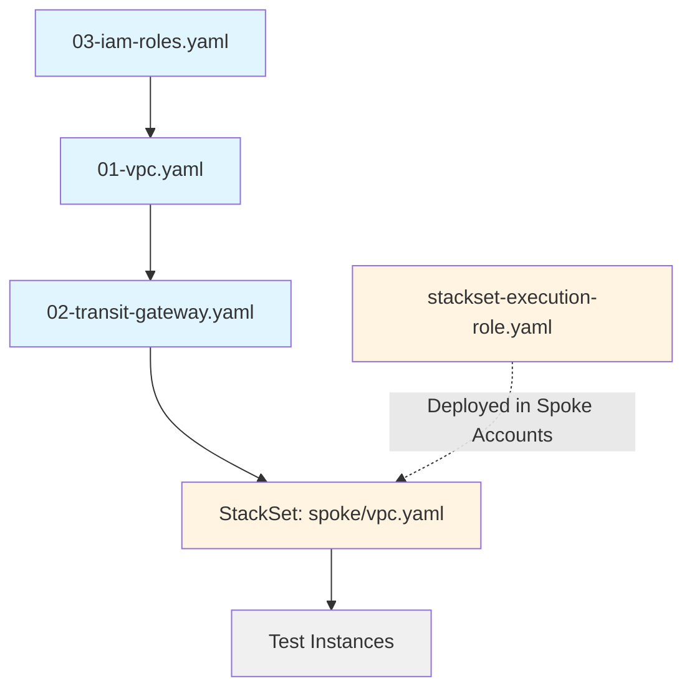
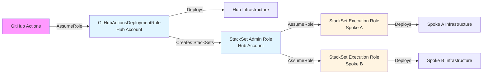
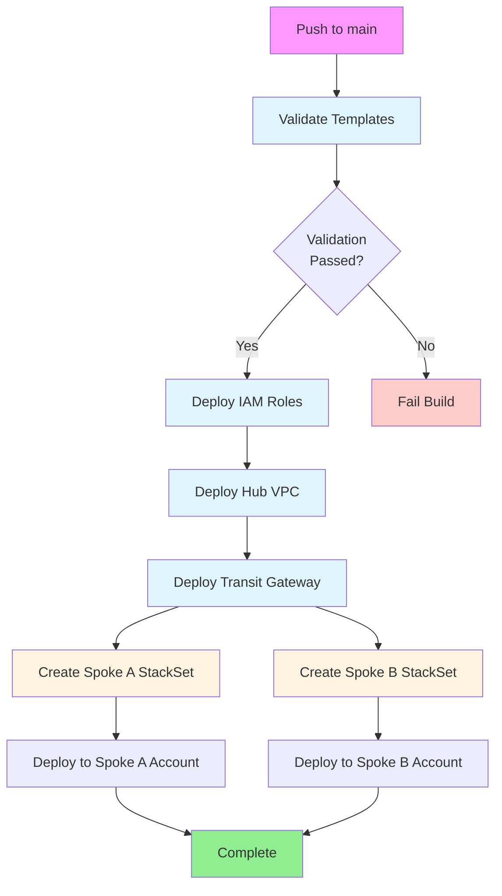

# Centralized VPC & Networking Automation - Architecture Overview

## Executive Summary

This document provides a comprehensive overview of the centralized networking architecture implemented across a multi-account AWS environment. The solution demonstrates production-ready Infrastructure as Code (IaC) practices using CloudFormation StackSets for cross-account deployment and GitHub Actions for CI/CD automation.

## Architecture Overview

### Network Topology

The architecture implements a **hub-and-spoke topology** with AWS Transit Gateway as the central routing hub:

- **Hub Account**: Hosts the Transit Gateway and provides centralized network management
- **Spoke Accounts**: Independent VPCs that connect to the hub for inter-VPC communication
- **Transit Gateway**: Enables transitive routing between all connected VPCs

### Design Principles

1. **Centralized Management**: Network team controls all networking from Hub Account
2. **Scalability**: Easy to add new spoke VPCs without modifying existing infrastructure
3. **Isolation**: Each spoke VPC maintains independence while enabling controlled connectivity
4. **Automation**: Full deployment automation via GitHub Actions
5. **Security**: Proper IAM roles, security groups, and network segmentation

## CIDR Allocation and Routing Design

### IP Address Planning

| Account | VPC Name | VPC CIDR | Public Subnets | Private Subnets | AZs |
|---------|----------|----------|----------------|-----------------|-----|
| Hub | Hub-VPC | 10.0.0.0/16 | 10.0.1.0/24, 10.0.2.0/24 | 10.0.11.0/24, 10.0.12.0/24 | 2 |
| Spoke A | SpokeA-VPC | 10.1.0.0/16 | 10.1.1.0/24 | 10.1.11.0/24 | 1 |
| Spoke B | SpokeB-VPC | 10.2.0.0/16 | 10.2.1.0/24 | 10.2.11.0/24 | 1 |

**Design Rationale:**
- Non-overlapping CIDR blocks prevent routing conflicts
- /16 VPC CIDRs provide 65,536 IP addresses per VPC
- /24 subnets provide 256 IPs per subnet (251 usable)
- Hub VPC uses 2 AZs for high availability
- Spoke VPCs use 1 AZ for cost optimization in POC

### Routing Architecture

#### Hub VPC Routing

**Public Subnets:**
- Default route (0.0.0.0/0) → Internet Gateway
- Used for NAT Gateways and internet-facing resources

**Private Subnets:**
- Default route (0.0.0.0/0) → NAT Gateway (for internet access)
- 10.1.0.0/16 → Transit Gateway (to Spoke A)
- 10.2.0.0/16 → Transit Gateway (to Spoke B)

#### Spoke VPC Routing

**Public Subnets:**
- Default route (0.0.0.0/0) → Internet Gateway

**Private Subnets:**
- Default route (0.0.0.0/0) → NAT Gateway
- 10.0.0.0/16 → Transit Gateway (to Hub)
- Other spoke CIDR → Transit Gateway (to other spoke)

#### Transit Gateway Routing

The Transit Gateway uses **automatic route propagation**:
- All VPC attachments propagate their CIDR blocks
- Single route table handles all routing decisions
- Enables transitive routing between all VPCs

**Traffic Flow Examples:**

1. **Spoke A to Spoke B:**
   ```
   Spoke A (10.1.11.10) → TGW Attachment → Transit Gateway → 
   TGW Attachment → Spoke B (10.2.11.10)
   ```

2. **Spoke A to Hub:**
   ```
   Spoke A (10.1.11.10) → TGW Attachment → Transit Gateway → 
   TGW Attachment → Hub (10.0.11.10)
   ```

3. **Hub to Internet (from private subnet):**
   ```
   Hub Private (10.0.11.10) → NAT Gateway → Internet Gateway → Internet
   ```

## CloudFormation Structure

### Template Organization

The CloudFormation templates are organized by deployment target and function:

```
cloudformation/
├── hub/                    # Hub Account templates
│   ├── 01-vpc.yaml        # VPC, subnets, route tables
│   ├── 02-transit-gateway.yaml  # TGW and attachments
│   └── 03-iam-roles.yaml  # Cross-account IAM roles
├── spoke/                  # Spoke Account templates
│   ├── vpc.yaml           # Parameterized VPC template
│   └── stackset-execution-role.yaml
└── test/
    └── ec2-test-instance.yaml
```

### Template Dependencies



### Key Design Patterns

#### 1. Parameter-Driven Templates

All templates use parameters instead of hardcoded values:

```yaml
Parameters:
  EnvironmentName:
    Type: String
    Default: Hub
  VpcCIDR:
    Type: String
    Default: 10.0.0.0/16
```

#### 2. CloudFormation Exports

Resources are exported for cross-stack references:

```yaml
Outputs:
  VPC:
    Value: !Ref VPC
    Export:
      Name: !Sub ${EnvironmentName}-VPC-ID
```

#### 3. ImportValue for Dependencies

Dependent stacks import values:

```yaml
VpcId: !ImportValue 
  Fn::Sub: ${EnvironmentName}-VPC-ID
```

#### 4. Conditional Logic

Templates handle both create and update scenarios:

```yaml
DependsOn: HubVPCAttachment  # Ensures TGW attachment exists
```

## Cross-Account Deployment Strategy

### IAM Role Architecture



### Role Definitions

**1. AWSCloudFormationStackSetAdministration (Hub Account)**
- Assumed by: CloudFormation service
- Purpose: Manage StackSets and assume execution roles in spoke accounts
- Permissions: AdministratorAccess (can be scoped down for production)

**2. AWSCloudFormationStackSetExecutionRole (Spoke Accounts)**
- Assumed by: StackSet Administration Role in Hub Account
- Purpose: Deploy CloudFormation stacks in spoke accounts
- Permissions: AdministratorAccess (can be scoped down for production)

**3. GitHubActionsDeploymentRole (Hub Account)**
- Assumed by: GitHub Actions via OIDC
- Purpose: Deploy infrastructure and manage StackSets
- Permissions: AdministratorAccess (can be scoped down for production)

### StackSet Deployment Flow

1. **Preparation**: StackSet Execution Roles deployed manually in spoke accounts
2. **StackSet Creation**: GitHub Actions creates StackSet in Hub Account
3. **Stack Instance Creation**: StackSet deploys stack instances to spoke accounts
4. **Execution**: Hub Account assumes execution role in each spoke account
5. **Deployment**: CloudFormation creates resources in spoke accounts

## CI/CD Workflow Summary

### GitHub Actions Workflows

#### 1. Template Validation (`validate-templates.yml`)

**Triggers:**
- Pull requests to main branch
- Pushes to main branch (for templates)

**Steps:**
1. Checkout code
2. Configure AWS credentials
3. Install cfn-lint
4. Validate each template with AWS CLI
5. Lint templates with cfn-lint
6. Report validation results

**Benefits:**
- Catches syntax errors before deployment
- Ensures templates follow best practices
- Prevents invalid templates from being deployed

#### 2. Infrastructure Deployment (`deploy-infrastructure.yml`)

**Triggers:**
- Push to main branch
- Manual workflow dispatch

**Jobs:**

**Job 1: deploy-hub**
1. Deploy IAM roles stack
2. Deploy Hub VPC stack
3. Deploy Transit Gateway stack
4. Export TGW ID for spoke deployment

**Job 2: deploy-spokes**
1. Retrieve Transit Gateway ID
2. Create/update StackSet for Spoke A
3. Create/update StackSet for Spoke B
4. Create stack instances in spoke accounts
5. Report deployment status

**Deployment Sequence:**



### Required Secrets and Variables

**GitHub Secrets:**
- `AWS_ROLE_ARN`: ARN of GitHub Actions OIDC role
- `HUB_ACCOUNT_ID`: Hub AWS account ID
- `SPOKE_A_ACCOUNT_ID`: Spoke A AWS account ID
- `SPOKE_B_ACCOUNT_ID`: Spoke B AWS account ID

**GitHub Variables:**
- `AWS_REGION`: Deployment region (default: us-east-1)

## Connectivity Verification

### Test Infrastructure

Test EC2 instances are deployed in private subnets of each VPC:
- Amazon Linux 2 instances (t2.micro)
- IAM role with SSM Session Manager access
- Security groups allowing ICMP and SSH from 10.0.0.0/8
- Pre-installed connectivity testing script

### Testing Methodology

**1. Deploy Test Instances:**
```bash
aws cloudformation deploy \
  --template-file cloudformation/test/ec2-test-instance.yaml \
  --stack-name <environment>-test-instance \
  --parameter-overrides EnvironmentName=<Hub|SpokeA|SpokeB>
```

**2. Connect via Session Manager:**
```bash
aws ssm start-session --target <instance-id>
```

**3. Run Connectivity Tests:**
```bash
/home/ec2-user/test-connectivity.sh
```

### Expected Results

**From Hub Instance:**
- ✅ Ping to Spoke A private IP (10.1.11.x)
- ✅ Ping to Spoke B private IP (10.2.11.x)
- ✅ Internet connectivity via NAT Gateway

**From Spoke A Instance:**
- ✅ Ping to Hub private IP (10.0.11.x)
- ✅ Ping to Spoke B private IP (10.2.11.x)
- ✅ Internet connectivity via NAT Gateway

**From Spoke B Instance:**
- ✅ Ping to Hub private IP (10.0.11.x)
- ✅ Ping to Spoke A private IP (10.1.11.x)
- ✅ Internet connectivity via NAT Gateway

### Verification Checklist

- [ ] Transit Gateway status: Available
- [ ] All TGW attachments status: Available
- [ ] TGW route table shows all VPC CIDRs
- [ ] VPC route tables have TGW routes
- [ ] Security groups allow ICMP
- [ ] Instances can ping each other
- [ ] Instances have internet access

## Limitations and Considerations

### Current Limitations

1. **Single Region**: Architecture deployed in one region only
2. **Basic Security**: Uses AdministratorAccess for IAM roles (should be scoped for production)
3. **No Encryption**: Transit Gateway attachments not encrypted (available in production)
4. **Cost**: NAT Gateways and Transit Gateway incur hourly charges
5. **No Monitoring**: CloudWatch alarms and VPC Flow Logs not implemented
6. **No DNS**: Route53 private hosted zones not configured

### Production Considerations

**Security Enhancements:**
- Implement least-privilege IAM policies
- Enable VPC Flow Logs for network monitoring
- Add AWS Config rules for compliance
- Implement AWS GuardDuty for threat detection
- Enable CloudTrail for audit logging

**High Availability:**
- Deploy NAT Gateways in multiple AZs
- Use multiple Transit Gateway attachments
- Implement Route53 health checks
- Add Application Load Balancers

**Cost Optimization:**
- Use VPC endpoints for AWS services
- Implement S3 Gateway endpoints
- Consider Transit Gateway Connect for SD-WAN
- Right-size NAT Gateway capacity

**Monitoring and Alerting:**
- CloudWatch dashboards for network metrics
- Alarms for TGW attachment failures
- VPC Flow Log analysis
- Network performance monitoring

**Compliance:**
- Tag all resources appropriately
- Implement backup policies
- Document change management procedures
- Regular security assessments

## Next Steps

### Immediate Next Steps

1. **Deploy to AWS Accounts**: Follow deployment guide in README.md
2. **Configure GitHub Secrets**: Add account IDs and role ARNs
3. **Test Connectivity**: Deploy test instances and verify routing
4. **Document Results**: Capture screenshots of successful tests

### Future Enhancements

1. **Multi-Region Support**: Extend to multiple AWS regions
2. **VPN Integration**: Add Site-to-Site VPN or Client VPN
3. **Direct Connect**: Integrate with on-premises networks
4. **Service Mesh**: Implement AWS App Mesh for microservices
5. **Network Firewall**: Add AWS Network Firewall for inspection
6. **Automation**: Terraform or CDK alternative implementation
7. **Monitoring**: Complete observability stack
8. **DR Strategy**: Multi-region failover capabilities

### Scaling the Architecture

**Adding New Spokes:**
1. Define new CIDR block (e.g., 10.3.0.0/16)
2. Create new StackSet with spoke VPC template
3. Update Hub VPC route tables with new CIDR
4. Deploy stack instance to new account
5. Verify connectivity

**Adding Services:**
- VPC endpoints for S3, DynamoDB, etc.
- PrivateLink for SaaS integrations
- Route53 Resolver for DNS
- AWS Network Firewall for traffic inspection

## Conclusion

This centralized networking architecture provides a solid foundation for multi-account AWS environments. The combination of Transit Gateway for connectivity, CloudFormation StackSets for deployment, and GitHub Actions for automation creates a scalable, maintainable solution that follows AWS best practices.

The architecture successfully demonstrates:
- ✅ Centralized network management
- ✅ Cross-account deployment automation
- ✅ Scalable hub-and-spoke topology
- ✅ Infrastructure as Code best practices
- ✅ CI/CD integration
- ✅ Connectivity verification

For production deployment, implement the security enhancements, monitoring, and high availability features outlined in the "Production Considerations" section.
